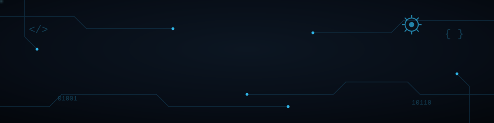

  

  <b>Analista de Suporte Técnico & Desenvolvedora de Software | Estudante de Engenharia de Software</b> 
  Focada em infraestrutura de TI, troubleshooting avançado, mitigação de riscos e automação de sistemas.

---

Profissional especializada em Infraestrutura de TI, Suporte N2 e Engenharia de Software, unindo vivência prática em ambientes corporativos, com uma base analítica rigorosa em desenvolvimento e segurança da informação. 

* 🔍 **Especialidade:** Diagnóstico rápido de falhas, troubleshooting de redes e sistemas operacionais, e cumprimento rigoroso de SLAs.
* 🛠️ **Stack Tecnológica:** Java, Spring Boot, Python, C#, SQL, n8n, Git/GitHub e Linux.
* 📚 **Formação & Certificações:** Graduação em Engenharia de Software (Uninter) e formações de destaque em Redes e Cibersegurança (**Cisco Networking Academy**) e Ciência da Computação (**Harvard University**).
* 🎯 **Objetivo:** Agregar valor imediato a equipes de tecnologia robustas, garantindo estabilidade, rastreabilidade e segurança nos serviços de TI.

---

## 🛠️ Tecnologias e Ferramentas

  

  

---

## 📊 Estatísticas do GitHub

