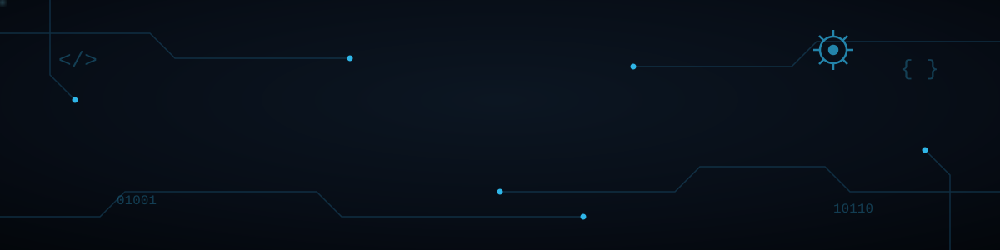

  

  <b>Desenvolvedora de Software | Engenharia de Software (Uninter) | Backend & AI Engineer</b> 
  Focada em desenvolvimento de software, automação com n8n + Python, engenharia de dados e análise de inteligência de negócios.

---

Profissional de tecnologia com forte base lógica em Engenharia de Software, unindo o desenvolvimento de aplicações escaláveis com rigor em qualidade de software, tratamento de dados e integração com inteligência artificial. 

* 🔍 **Especialidade:** Desenvolvimento Backend, construção de APIs RESTful, automação de fluxos com n8n e Python, engenharia de dados e Power BI.
* 🛠️ **Stack Tecnológica:** Python, Node.js, C# (.NET), Java, Spring Boot, R, Power BI, Docker, SQL, Git/GitHub e Linux.
* 🤖 **IA Aplicada & Dados:** Desenvolvimento com MCP (Model Context Protocol), arquiteturas RAG (Retrieval-Augmented Generation), análise estatística e visualização de dados.
* 📚 **Formação & Certificações:** Graduação em Engenharia de Software (Uninter), Qualidade de Software e Automação e formações de destaque em Redes e Cibersegurança (**Cisco Networking Academy**) e Ciência da Computação (**Harvard University**).
* 🎯 **Objetivo:** Integrar equipes de engenharia de alta performance, desenvolvendo soluções robustas, seguras e orientadas a resultados de alto impacto.

---

## 🛠️ Tecnologias e Ferramentas

  

  
  
  
  
  
  
  
  
  

---

## 📊 Estatísticas do GitHub

  

---

## 📈 Gráfico de Contribuições

  

